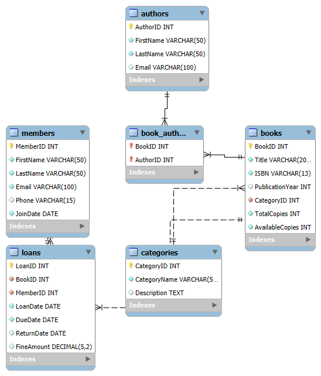

# Library Management System Database

## Description
This project is a MySQL database designed for a Library Management System. It manages books, members, authors, loans, and book categories with a focus on relational integrity and normalization. The database is in **3NF** (satisfying 1NF and 2NF) and includes:

- **Tables**: Categories, Books, Authors, Book_Authors (junction table), Members, Loans.
- **Relationships**:
  - **One-to-Many**: Categories to Books, Members to Loans, Books to Loans.
  - **Many-to-Many**: Books to Authors via Book_Authors.
- **Constraints**: Primary keys, foreign keys, `NOT NULL`, `UNIQUE`, and `CHECK` constraints for data validation (e.g., ISBN format, non-negative copies).
- **Indexes**: Added on `Loans` for efficient querying.

The database supports tracking book availability, member loans, author-book relationships, and fines for overdue books.

## How to Run/Setup the Project
1. **Prerequisites**:
   - MySQL Server (version 8.0 or higher recommended for `CHECK` constraint support).
   - MySQL client (e.g., MySQL Workbench, command-line `mysql`, or DBeaver).
   - Git (for cloning the repository).

2. **Steps**:
   - Clone this repository:
     ```bash
     git clone https://github.com/Darrystic/LibraryDB.git
     cd <LibraryDB>
     ```
   - Log in to MySQL:
     ```bash
     mysql -u root -p
     ```
   - Run the SQL script to create the database and tables:
     ```bash
     source LibraryDB.sql
     ```
     Alternatively, in MySQL Workbench:
     - Open MySQL Work Mistake: you meant MySQL Workbench
     - Go to `File > Run SQL Script` and select `LibraryDB.sql`.
   - Verify the database:
     ```sql
     USE LibraryDB;
     SHOW TABLES;
     ```

3. **Notes**:
   - Ensure MySQL is configured to support `CHECK` constraints (MySQL 8.0.16+).
   - Adjust `VARCHAR` lengths or other constraints as needed for your use case.
   - The database can be extended with additional tables (e.g., for reservations or staff).

## Entity-Relationship Diagram (ERD)
Below is the ERD for the Library Management System database, showing tables and relationships:



To generate the ERD:
- **MySQL Workbench**: Import `LibraryDB.sql`, then go to `Database > Reverse Engineer` to create the ERD. Export as PNG via `File > Export > Export as PNG`.
- **dbdiagram.io**: Copy the `CREATE TABLE` statements from `LibraryDB.sql`, paste into [dbdiagram.io](https://dbdiagram.io), and download as `erd.png`.

## Files
- `LibraryDB.sql`: SQL script to create the database and tables.
- `erd.png`: Entity-Relationship Diagram (generate and upload as described).

## License
This project is for educational purposes and can be used freely. No warranty is provided.